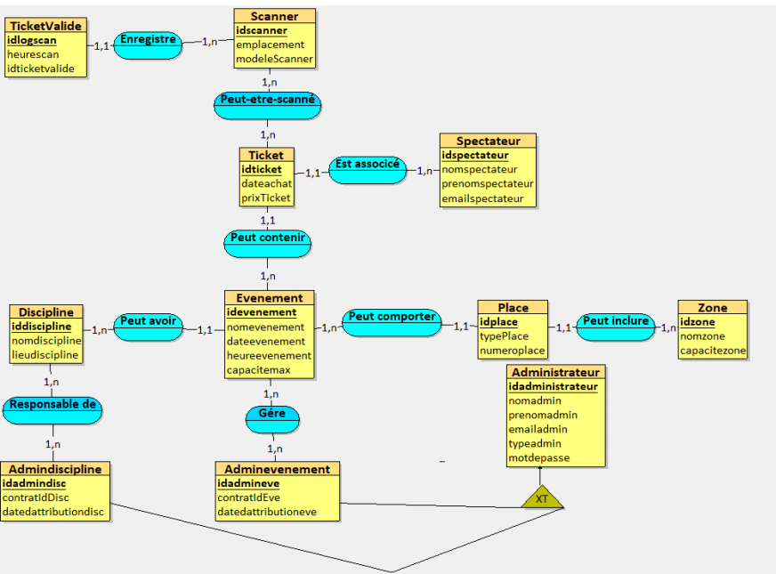
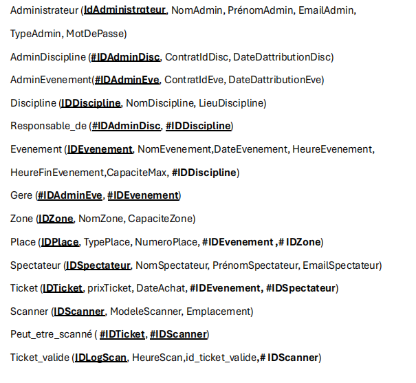
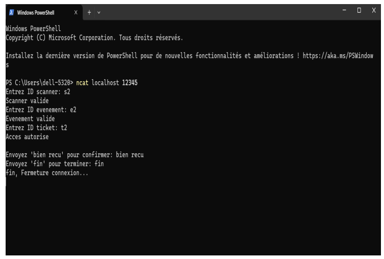
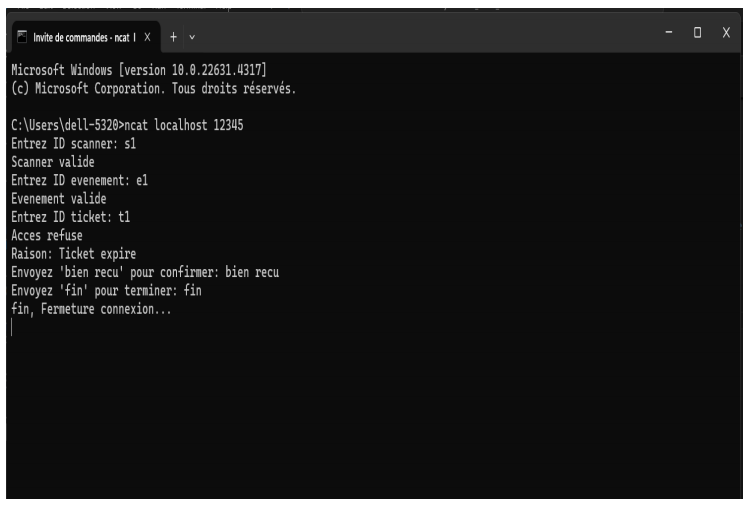
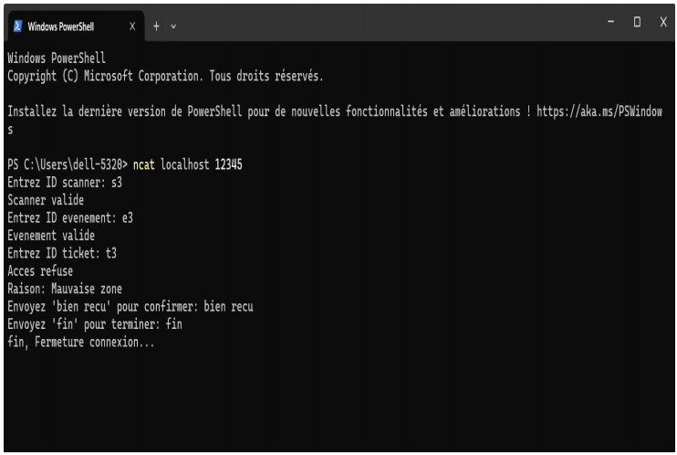
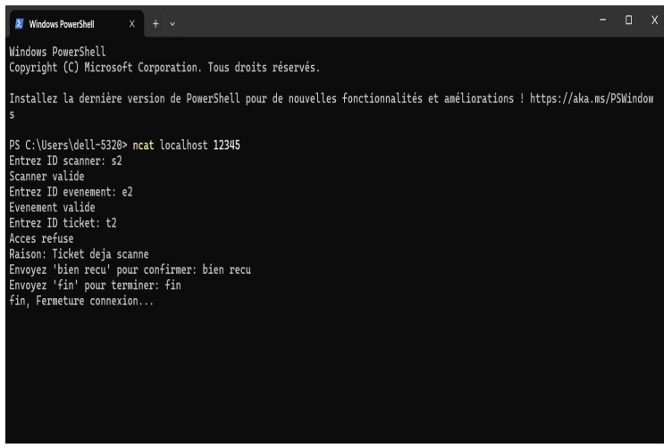
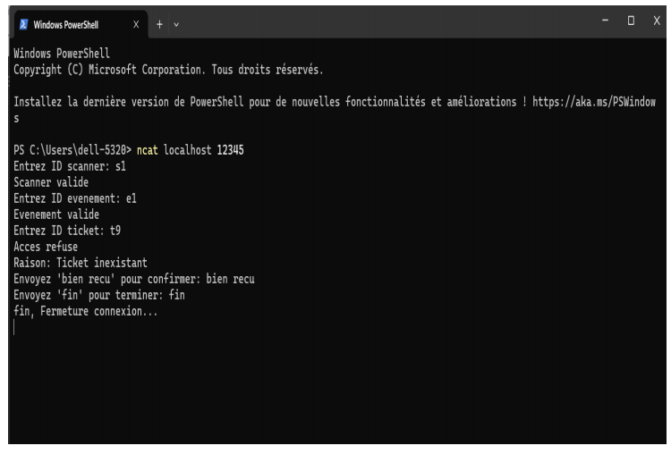
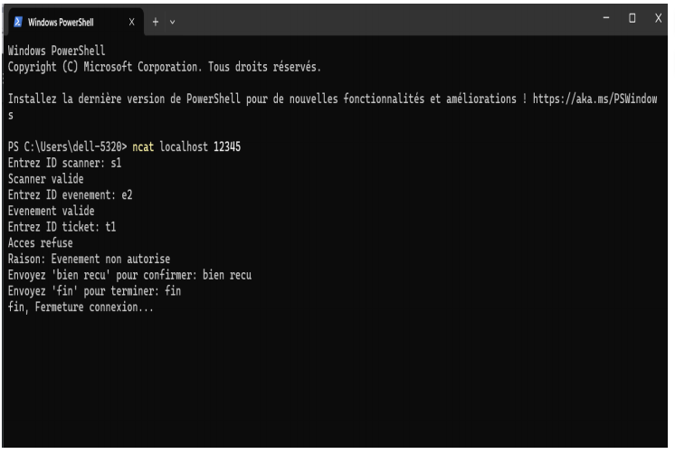

# Gestion des tickets d’un événement sportif

## Présentation

Ce projet a été réalisé dans le cadre de l’UE Bases de Données / Réseaux (Licence Informatique, 3e année, 2024).  
Il vise à concevoir un système d’accréditation et de gestion centralisée des tickets pour des événements sportifs, avec scan des tickets via QR codes et validation en temps réel.

**Auteurs :**  
- Azzeddine LAMARI
- Inas BOUKILI  
- Dara OFFIONG  

---

## Sommaire

- [Contexte du projet](#contexte-du-projet)
- [Fonctionnalités](#fonctionnalités)
- [Modélisation des données](#modélisation-des-données)
    - [Dictionnaire de données](#dictionnaire-de-données)
    - [MCD (Modèle Conceptuel de Données)](#mcd-modèle-conceptuel-de-données)
    - [MLD (Modèle Logique de Données)](#mld-modèle-logique-de-données)
- [Scénarios réseaux](#scénarios-réseaux)
- [Jeu de données exemple](#jeu-de-données-exemple)
- [Technologies utilisées](#technologies-utilisées)
- [Installation et utilisation](#installation-et-utilisation)
- [Annexes](#annexes)
- [Rapport complet](#rapport-complet)

---

## Contexte du projet

Le système permet au personnel d’un événement sportif de scanner les tickets des spectateurs à l’aide de QR codes et de scanners portatifs pour vérifier leur validité à l’entrée et dans différentes zones.  
La gestion des tickets est centralisée dans une base de données, permettant de :
- Valider les tickets à chaque scan
- Empêcher les fraudes (tickets déjà utilisés, expirés, ou falsifiés)
- Gérer les accès par zone et par événement
- Suivre le nombre de spectateurs présents

---

## Fonctionnalités

- **Scan et validation de tickets (QR code)**
- **Gestion des accès par zone**
- **Base de données relationnelle centralisée**
- **Gestion des utilisateurs (spectateurs, administrateurs, etc.)**
- **Gestion des événements et disciplines**
- **Scénarios de tests réseaux réalistes (NCAT, client/serveur en Python et C)**

---

## Modélisation des données

### Dictionnaire de données

Le projet comprend les entités suivantes : Administrateur, AdminDiscipline, AdminEvenement, Discipline, Evenement, Spectateur, Ticket, Scanner, Ticket_valide, Place, Zone.

*(Voir le rapport pour le dictionnaire complet)*

### MCD (Modèle Conceptuel de Données)

  
*Schéma MCD (extrait du rapport)*

### MLD (Modèle Logique de Données)

  
*Schéma MLD (extrait du rapport)*

---

## Scénarios réseaux

Voici quelques scénarios réseaux illustrant le fonctionnement du système lors du scan de tickets :

- **Scan d’un ticket valide**  
  
- **Scan d’un ticket expiré**  
  
- **Scan d’un ticket pour une mauvaise zone**  
  
- **Scan d’un ticket déjà scanné**  
  
- **Scan d’un ticket inexistant**  
  
- **Accès à un événement non autorisé**  
  

---

## Jeu de données exemple

Le projet inclut un jeu de données réaliste pour tester le système, incluant des exemples d’administrateurs, disciplines, événements, spectateurs, tickets, scanners, etc.

*(Voir la documentation pour le jeu de données complet)*

---

## Technologies utilisées

- **Python** (serveur réseau)
- **C** (client réseau)
- **SQL** (base de données relationnelle)
- **NCAT** (tests réseaux)
- **QR Code** (gestion des tickets)
- **GitHub** (gestion de version et documentation)

---

## Installation et utilisation

1. **Cloner le dépôt**
2. **Configurer la base de données**
    - Importer les scripts SQL fournis dans le dossier `/sql` (à créer si besoin).
3. **Lancer le serveur**
    - Voir le code Python dans `/server`.
4. **Lancer le client**
    - Voir le code C dans `/client`.
5. **Effectuer des tests réseaux**
    - Utiliser les scripts et exemples fournis dans `/tests`.

---

## Annexes

- **Code source** (client, serveur, scripts SQL)
- **Fichiers de configuration**
- **Tests réseaux (NCAT)**
- **Captures d’écran de l’application web**
- **Requêtes SQL utilisées**

---

## Rapport complet

Le rapport détaillé du projet est disponible ici :  
[Documentation.pdf](Documentation.pdf)

---

## Licence

Ce projet est proposé sous licence MIT (ou autre, à préciser selon ton choix).

---

## Contact

Pour toute question ou suggestion, n’hésitez pas à contacter les auteurs via GitHub ou LinkedIn.

---

